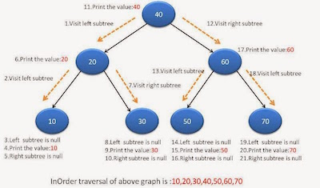

Binary Search Tree
==========

NOTES:
- BST property is such that a node's left subtree value is always at most its value
- Node x, left(x) =< x. Also right(x) > x

Implementations:


```
class Node<V> {
    Node parent;
    Node left;
    Node right;
    V value;
    Node(Node parent, Node left, Node right, V value) {
        this.parent = parent;
        this.left = left;
        this.right = right;
        this.value = value;
    }
    void print(){}
}
```

[INORDER TREE WALK]


```
//recursive
void inorder(Node node) {
    if (node != null) {
        inorder(node.left);
        node.print();
        inorder(node.right);
    }
}
```

```
//iterative
void inorder(Node root) {
    Stack<Node> stack = new Stack<>();
    Node current = root;
    while (!stack.isEmpty() || current != null) {
        if (current != null) {
            stack.push(current);
            current = current.left;
        } else {
            Node n = stack.pop();
            n.print();
            current = n.right;
        }   
    }
}
```
[\INORDER TREE WALK]

[SEARCH]
```
//recursive
Node search(Node root, int value) {
    if (root == null || root.value == value) return root;
    if (value <= root.value) return search(root.left, value);
    else return search(root.right, value);
}
```

```
//iterative
Node search(Node root, int value) {
    if (root == null || root.value == value) return root;
    Node current = root;
    while (current != null && current.value != value) {
        if (value <= current.value) current = current.left;
        else current = current.right;
    }
    return current;
}
```

[/SEARCH]

